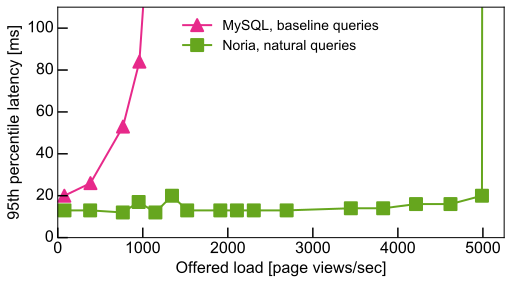

# Noria: data-flow for high-performance web applications

[](https://travis-ci.org/mit-pdos/noria)

Noria is a new streaming data-flow system designed to act as a fast
storage backend for read-heavy web applications based on [this
paper](https://jon.tsp.io/papers/osdi18-noria.pdf) from
[OSDI'18](https://www.usenix.org/conference/osdi18/presentation/gjengset).
It acts like a database, but precomputes and caches relational query
results so that reads are blazingly fast. Noria automatically keeps cached
results up-to-date as the underlying data, stored in persistent _base
tables_, change. Noria uses partially-stateful data-flow to reduce memory
overhead, and supports dynamic, runtime data-flow and query change.

Noria comes with [a MySQL
adapter](https://github.com/mit-pdos/noria-mysql) that implements the
binary MySQL protocol. This lets any application that currently talks to
MySQL or MariaDB switch to Noria with minimal effort. For example,
running a [Lobsters-like workload](https://github.com/jonhoo/trawler)
that issues the [same SQL
queries](https://github.com/mit-pdos/soup-benchmarks/tree/master/lobsters/mysql)
as the real [Lobsters website](https://lobste.rs), Noria improves
throughput supported by 5x:



At a high level, Noria takes a set of parameterized SQL queries (think
[prepared
statements](https://en.wikipedia.org/wiki/Prepared_statement)), and
produces a [data-flow program](https://en.wikipedia.org/wiki/Dataflow)
that maintains [materialized
views](https://en.wikipedia.org/wiki/Materialized_view) for the output
of those queries. Reads now become fast lookups directly into these
materialized views, as if the value had been directly cached in
memcached. The views are then kept up-to-date incrementally through the
data-flow, which yields high write throughput.

## Running Noria

You need nightly Rust to run this code. This will be arranged for
automatically if you're using [`rustup.rs`](https://rustup.rs/).

You build the Noria library and its associated worker binary with
```console
$ cargo build --release
```

To start a long-running Noria worker, ensure that ZooKeeper is running,
and then run:
```console
$ cargo r --release --bin souplet -- --deployment myapp --no-reuse --address 172.16.0.19 --shards 0
```

`myapp` here is a _deployment_. Many Noria workers can operate in a
single deployment at the same time, and will share the workload between
them. Workers in the same deployment automatically elect a leader and
discovery each other via [ZooKeeper](http://zookeeper.apache.org/).

Once the Noria worker is running, you can discover its REST API port
through Zookeeper via this command:
```console
$ cargo run --manifest-path=consensus/Cargo.toml --bin zk-util -- \
    --show --deployment testing
    | grep external | cut -d' ' -f4
```

A basic graphical UI runs at `http://IP:PORT/graph.html` and shows
the running data-flow graph.

You can now start the [MySQL
adapter](https://github.com/mit-pdos/noria-mysql), and it should
automatically locate the running worker through ZooKeeper (use `-z` if
it ZooKeeper is not running on `localhost:2181`).

You should then be able to point your application at `localhost:3306` to
send queries to Noria. If your application crashes, this is a bug, and
we would appreciate it if you [open an
issue](https://github.com/mit-pdos/noria/issues). You may also want to
try to disable automatic re-use (with `--no-reuse`) or sharding (with
`--shards 0`) in case those are misbehaving.

You can manually inspect the database using the `mysql` CLI, or by
using the [Noria web interface](https://github.com/mit-pdos/noria-ui).

You can also run the self-contained Noria
[example](examples/basic-recipe.rs), which does not require ZooKeeper:
```console
$ cargo run --example basic-recipe
```

## Noria development

Noria is a large piece of software that spans many sub-crates and
external tools (see links in the text above). Each sub-crate is
responsible for a component of Noria's architecture, such as external
API (`api`), mapping SQL to data-flow (`mir`), and executing data-flow
operators (`dataflow`). The code in `src/` is the glue that ties these
pieces together by establishing materializations, scheduling data-flow
work, orchestrating Noria program changes, handling failovers, etc.

[`src/lib.rs`](src/lib.rs) has a pretty extensive comment at the top of
it that goes through how the Noria internals fit together at an
implementation level. While it occasionally lags behind, especially
following larger changes, it should serve to get you familiarized with
the basic building blocks relatively quickly.

The sub-crates each serve a distinct role:

 - [`api/`](api/): everything that an external program communicating
   with Noria needs. This includes types used in RPCs as
   arguments/return types, as well as code for discovering Noria workers
   through ZooKeeper, establishing a connection to Noria through
   ZooKeeper, and invoking the various RPC exposed by the Noria
   controller ([`src/controller/inner.rs`](src/controller/inner.rs)).
 - [`basics/`](basics/): core data-structures and types used throughout
   Noria, including [`DataType`](basics/src/data.rs) (Noria's "value"
   type), node addresses, base table operations, etc.
 - [`benchmarks/`](benchmarks/): various Noria benchmarks, one in each
   folder. These will likely move into
   [noria-benchmarks](https://github.com/mit-pdos/noria-benchmarks) in
   the near future. The most frequently used one is `vote`, which runs
   the vote benchmark from §8.2 of the OSDI paper. You can run it in a
   bunch of different ways (`--help` should be useful), and with a bunch
   of different backends. The `localsoup` backend is the one that's easiest
   to get up and running with.
 - [`channel/`](channel/): a wrapper around TCP channels that Noria uses
   to communicate between clients and servers, and inside the data-flow
   graph. At this point, this is mostly a thin wrapper around
   [`async-bincode`](https://docs.rs/async-bincode/), and it might go
   away in the long run.
 - [`consensus/`](consensus/): code for interacting with ZooKeeper to
   determine which Noria worker acts as the controller, and for
   detecting failed controllers which necessitate a controller
   changeover.
 - [`dataflow/`](dataflow/): the code that implements the internals of
   the data-flow graph. This includes implementations of the different
   operators ([`ops/`](dataflow/src/ops/)), "special" operators like
   leaf views and sharders
   ([`node/special/`](dataflow/src/node/special/)), implementations of
   view storage ([`state/`](dataflow/src/state/)), and the code that
   coordinates execution of control, data, and backfill messages within
   a thread domain ([`domain/`](dataflow/src/domain/)).
 - [`mir/`](mir/): the code that implements Noria's SQL-to-dataflow
   mapping. This includes resolving columns and keys, creating dataflow
   operators, and detecting reuse opportunities, and triggering
   migrations to make changes after new SQL queries have been added.
   @ms705 is the primary author of this particular subcrate, and it
   builds largely upon [`nom-sql`](https://docs.rs/nom-sql/).
 - [`src/`](src/): the "high-level" components of Noria such as RPC
   handling, domain scheduling, connection management, and all the
   controller operations (listening for heartbeats, handling failed
   workers, etc.).

To run the test suite, use:
```console
$ cargo test
```

Build and open the documentation with:
```console
$ cargo doc --open
```
